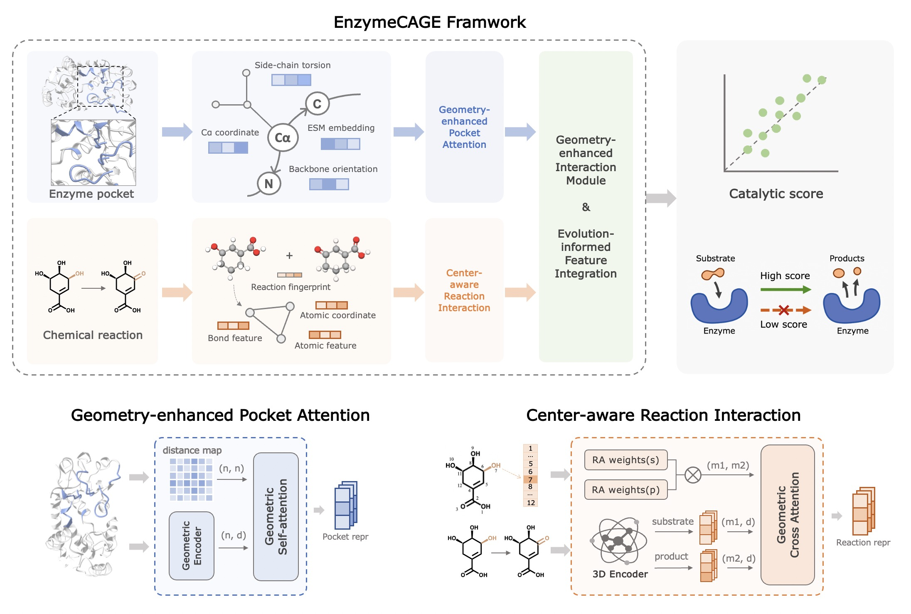

# EnzymeCAGE: A Geometric Foundation Model for Enzyme Retrieval with Evolutionary Insights



## Environment 
```
conda create -n enzymecage python=3.8

pip install pyyaml==6.0
pip install tqdm==4.66.2
pip install numpy==1.24.3
pip install pandas==1.4.2
pip install ase==3.22.1
pip install rdkit-pypi==2022.9.5
pip install fair-esm==2.0.0
pip install biopython==1.83
pip install drfp==0.3.6
pip install mlcrate==0.2.0
pip install rxn-chem-utils==1.5.0
pip install torch==2.1.0 torch-geometric==2.5.3 torch-scatter==2.1.2 torch-cluster==1.6.3 -f https://download.pytorch.org/whl/cu122/torch_stable.html
pip install transformers==4.14.1

```

## Running pipeline
* Download csv format dataset and alphafold2 structures of enzymes
* Run AlphaFill to get the catalytic pocket
* Prepare the feature of enzymes and reactions
* Train the model, retrieve the candidate enzymes for reactions, do inference and ranking
* Evaluate the performance of the model

## Dataset
First, download the [dataset](https://zenodo.org/records/14613354) and extract it to the current directory.

### Option 1: Directly use the extracted pockets
We have run AlphaFill and pre-extracted the enzyme pockets from the dataset, and you can directly use this part of the data to reproduce the experimental results. The pockets are located in `./dataset/pocket/alphafill_8A`

Note: To improve the running speed of AlphaFill, we set the number of homologous proteins to query to 5 (the default is 200). The corresponding parameter is `--blast-report-limit=5`

### Option 2: Rerun AlphaFill to extract the pockets
If you need to calculate features for model training or directly perform inference on your own dataset, you will need to run AlphaFill to extract the pockets yourself.

**Step 1: Get the CIF format structure of enzymes**

If your dataset only contains protein sequences, you will first need to obtain structural information (preferably in CIF format). You can either deploy [colabfold](https://github.com/YoshitakaMo/localcolabfold.git) locally or choose to [run it online](https://colab.research.google.com/github/sokrypton/ColabFold/blob/main/AlphaFold2.ipynb)，

**Step 2: Deploy AlphaFill**

First, download the PDB-REDO database (this may take some time):
```shell
cd dataset/PDB-REDO
rsync -av --exclude=attic rsync://rsync.pdb-redo.eu/pdb-redo/ pdb-redo/
```

Next, download the code and deploy AlphaFill:
```shell
cd feature/pkgs
git clone https://github.com/PDB-REDO/alphafill.git
cp ../../scripts/run_alphafill ./alphafill
cd alphafill
```
Then, follow the [tutorial](https://github.com/PDB-REDO/alphafill) to set up the environment.

**Step 3: Run AlphaFill**

After setup is complete, run the script `run_alphafill.py` to execute AlphaFill and extract the pockets:
```shell
python scripts/run_alphafill.py \
    --input_dir {CIF_DIR} \ # Folder containing CIF files
    --output_dir {OUT_DIR} \ # Output folder for extracted pockets
    --pdb_fasta {FASTA_PATH} \ # Located in dataset/PDB-RED/pdbredo_seqdb.txt
    --pdb_redo_dir {PDB_REDO_DIR} \ # Located in dataset/PDB-REDO/pdb-redo/
```


## Feature

After extracting pockets, we need to generate features for model training. Since calculating molecular conformations for the full dataset is time-consuming, it is recommended to directly use our precomputed conformation files. For feature computation on test data, calculations can be performed directly.

```shell
cd feature
python main.py \
    --data_path {DATA_PATH} \
    --alphafill_result_dir {TRANS_DIR} \
    --pocket_dir {POCKET_DIR} \
    --skip_calc_mol_conformation # If you already have conformation data
```

* `--data_path`: Required, specifies the location of the enzyme-reaction pairs dataset.
* `--alphafill_result_dir`: If you re-extracted the pockets using AlphaFill, this should be the path to the AlphaFill output. Note that the CIF files in the result must end with the suffix '_transplant.cif'.
* `--pocket_dir`: If you are using our pre-extracted pocket data, set this parameter to the folder containing the precomputed pocket data.
* `--skip_calc_mol_conformation`: Add this parameter to skip molecular conformation calculations if you have already computed the conformations or are using our precomputed conformation data.

Feature computation for test data (200 pairs):
```shell
cd feature
python main.py \
    --data_path ../dataset/testing/test.csv \
    --alphafill_result_dir ../dataset/testing/alphafill_results \
```

Feature computation for full data(~1M pairs):
```shell

cd feature
python main.py \
    --data_path ../dataset/all_train_test.csv \
    --pocket_dir ../dataset/pocket/alphafill_8A \
    --skip_calc_mol_conformation
```


## Retrieve & Inference
The evaluation processes for Loyal-1968 and Orphan-194 differ slightly. For the Loyal-1968 test set, candidate enzymes have already been assigned to each reaction, allowing us to directly use the trained model to predict the catalytic scores. In contrast, for the Orphan-194 test set, we must first retrieve candidate enzymes for each reaction before using the trained model to predict the catalytic scores. Pretrained models are [here](https://zenodo.org/records/14613420).

Retrieve candidate enzymes to orphan reactions:
```shell
python retrieve.py --data_path dataset/orphan-rxns/orphan_reactions.csv
```

Do inference on the retrieved candidate enzymes:
```shell
python infer.py --config config/infer/infer_orphan-rxns.yaml
```

## Evaluation

Specify the score file after inference and evaluate the results:
```shell
# For test set Orphan-194
python evaluate.py --result_path checkpoints/orphan-rxns/seed_42/orphan_reactions_retrievel_cands_best_model.csv

# For test set Loyal-1968
python evaluate.py --result_path checkpoints/unseen-enzymes/seed_42/test_result.csv
```

## Citation
Please cite the following preprint when referencing EnzymeCAGE:
```
@article{liu2024enzymecage,
  title={EnzymeCAGE: A Geometric Foundation Model for Enzyme Retrieval with Evolutionary Insights},
  author={Liu, Yong and Hua, Chenqing and Zeng, Tao and Rao, Jiahua and Zhang, Zhongyue and Wu, Ruibo and Coley, Connor W and Zheng, Shuangjia},
  journal={bioRxiv},
  year={2024},
  publisher={Cold Spring Harbor Laboratory}
}
```
